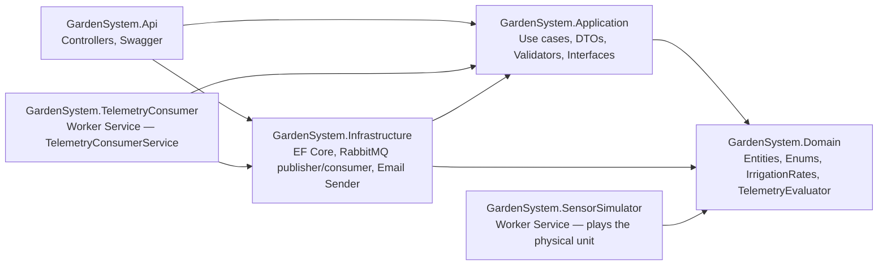
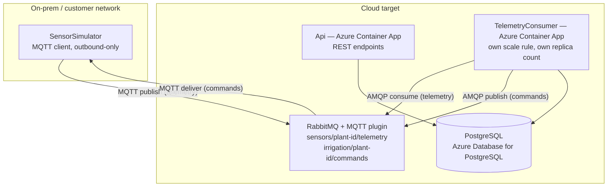
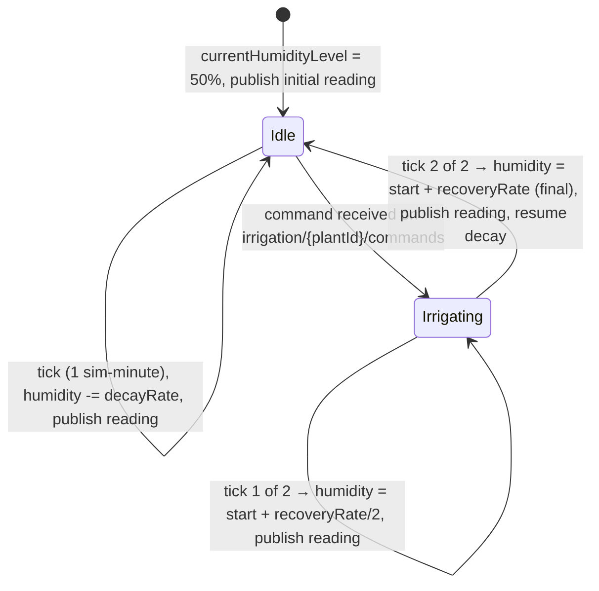

# Automated Garden Management System — Architecture & Approach

**Candidate:** Yorick Scheyltjens · **Role:** Backend .NET Engineer @ In The Pocket
**Stack:** C# / .NET 10, ASP.NET Core Web API, EF Core, PostgreSQL, RabbitMQ, Docker

This document is the design spec I implement from. It covers the full system, including the four bonus areas, because I chose to build all of them rather than describe them abstractly. Where I deviated from the assignment's literal data model, I explain why — the case explicitly rewards "thoughtful decisions when facing constraints," so I'm making those decisions visible instead of burying them in code.

### TL;DR — the six moving parts

Everything below runs locally via `docker-compose up`. Nothing is deployed live; Section 3.3 covers what would change if it had to be.

| Component | What it is | Talks to |
|---|---|---|
| **Api** | ASP.NET Core Web API — CRUD, auth, reporting, for garden owners | Users (HTTP), Postgres |
| **TelemetryConsumer** | Own Worker Service container — consumes sensor telemetry, decides watering, publishes commands | RabbitMQ (AMQP), Postgres |
| **SensorSimulator** | Own Worker Service container — plays the physical irrigation unit; the "mock" | RabbitMQ (MQTT) |
| **RabbitMQ** | Broker (MQTT + AMQP), the only channel between cloud logic and the local unit | Everything above |
| **Postgres** | Data store | Api, TelemetryConsumer |
| **Domain** (shared library, not a container) | Pure business rules (`IrrigationRates`, `TelemetryEvaluator`, overcrowding) referenced by both Api-side and SensorSimulator, so both sides can never drift out of sync | — |

No polling anywhere on the watering-decision path — only for the SensorSimulator's low-frequency plant-roster lookup (Section 8.4). No Azure Functions anywhere in the local build (Section 3.1 explains why).

---

## 1. Scope & explicit assumptions

The assignment is intentionally open on a few points. Rather than guess silently, here's what I decided and why:

| Question | Decision | Reasoning |
|---|---|---|
| Is a user pre-authenticated or does auth gate everything? | Auth gates everything except `POST /auth/register` and `POST /auth/login` | The domain model ties gardens to a user; without auth, "gardens linked to the user account" has no enforcement mechanism. |
| Does `RealtimePlantMetric` need history, or just current state? | Split into `PlantState` (current snapshot, 1:1 with Plant) + `IrrigationEvent` (append-only log) | The reporting bonus asks for "frequency of watering per plant within a period" — that's impossible from a single last-event snapshot. This is the one place I extend the given entity model. |
| Real-time minutes or accelerated simulation? | Configurable tick interval (default: 1 tick = 1 simulated minute = 5 real seconds) | A reviewer running this locally shouldn't wait a real hour to see a watering cycle complete. Also makes tests fast without mocking time in production code paths. |
| Delete = hard or soft? | Soft delete (`DeletedAtUtc` nullable column) on `Plant` and `Garden` | The reporting bonus needs "number of deleted plants since date X." A hard delete destroys that data. |
| Which DB? | PostgreSQL | Free, runs cleanly in docker-compose, and the case explicitly lists it as a "plus." (Also consistent with tooling I already use daily.) |
| Which .NET version? | .NET 10 (current LTS, supported through November 2028) | The vacancy asks for ".NET 6+," which .NET 8 would technically satisfy — but .NET 8 and .NET 9 both reach end-of-support on November 10, 2026. Starting a new project three months before its runtime loses support, when a current LTS has been out for nearly a year, is avoidable risk for no benefit. |
| How does the cloud side command the local irrigation unit? | Device-initiated persistent MQTT connection (RabbitMQ + MQTT plugin), not inbound push, not naive polling | Real home networks sit behind NAT/CGNAT with no inbound public IP; a device-initiated pub/sub connection avoids opening firewall ports while still delivering commands with near-zero latency. Detailed in Section 8. |
| Who owns the decay/recovery simulation state machine? | A separate `SensorSimulator` process (plays the role of the physical unit), not the Api | Mirrors real IoT design: the cloud never assumes a command succeeded — it reacts to confirming telemetry, it doesn't dictate timing to hardware it doesn't control. |

---

## 2. Domain model

```mermaid
erDiagram
    USER ||--o{ GARDEN : owns
    GARDEN ||--o{ PLANT : contains
    PLANT ||--|| PLANT_STATE : "has current"
    PLANT ||--o{ IRRIGATION_EVENT : "has history of"

    USER {
        guid UserId PK
        string FirstName
        string LastName
        int Age
        string Email UK
        string PasswordHash
        bool EmailVerified
        datetime CreatedAtUtc
    }
    GARDEN {
        guid GardenId PK
        guid UserId FK
        string GardenName
        decimal TotalSurfaceArea
        string LocationDescription
        decimal Latitude "nullable"
        decimal Longitude "nullable"
        int TargetHumidityLevel "0-100"
        datetime CreatedAtUtc
        datetime DeletedAtUtc "nullable, soft delete"
    }
    PLANT {
        guid PlantId PK
        guid GardenId FK
        string PlantName
        string Species
        int PlantType "enum: Vegetable/Fruit/Flower"
        date PlantationDate
        decimal SurfaceAreaRequired
        int IdealHumidityLevel "0-100"
        datetime CreatedAtUtc
        datetime DeletedAtUtc "nullable, soft delete"
    }
    PLANT_STATE {
        guid PlantId PK_FK
        decimal CurrentHumidityLevel
        datetime LastIrrigationStartTime "nullable"
        datetime LastIrrigationEndTime "nullable"
        bool IsCurrentlyIrrigating
        datetime UpdatedAtUtc
    }
    IRRIGATION_EVENT {
        guid IrrigationEventId PK
        guid PlantId FK
        datetime StartTimeUtc
        datetime EndTimeUtc "nullable until telemetry confirms completion"
        decimal HumidityBefore
        decimal HumidityAfter "nullable until confirmed"
    }
```

`PlantState` mirrors the assignment's `RealtimePlantMetric` almost exactly (kept for fidelity to the spec). `IrrigationEvent` is the addition that makes reporting possible. `EndTimeUtc`/`HumidityAfter` are nullable because the Api logs the *start* of an event optimistically (the moment it issues a command) but only fills in the end once telemetry confirms it — see Section 8.

**Enum:** `PlantType { Vegetable, Fruit, Flower }` — drives both the decay rate and the watering-recovery rate (Section 8), so it's modeled as a first-class domain concept with behavior attached (see `IrrigationRates` below), not just a display label.

---

## 3. Architecture

### 3.1 Components

Six deployable/logical pieces, dependencies point inward within the .NET solution:



- **Domain**: no dependencies on anything else. Contains entities, `PlantType`, and pure calculation/decision logic (`IrrigationRates.GetDecayRate/GetRecoveryRate`, `TelemetryEvaluator.ShouldStartWatering`) — the code with the heaviest unit-test coverage because it's pure and business-critical. Referenced directly by `SensorSimulator` as a project reference, so the simulator and the rest of the system agree on the exact same rates by construction, not by convention.
- **Application**: CQRS-lite via MediatR — one `Command`/`Query` + `Handler` per use case. FluentValidation validators run as a MediatR pipeline behavior.
- **Infrastructure**: `GardenDbContext` (EF Core), repository implementations, `IIrrigationSystemClient` (publishes watering commands to RabbitMQ — this is the "mocked irrigation system" from the assignment; mocked in the sense that `SensorSimulator` stands in for real hardware, not in the sense that it's a no-op stub), `IEmailSender`.
- **Api**: thin controllers dispatching to MediatR — purely the user-facing HTTP tier now. No telemetry handling here (see below).
- **TelemetryConsumer**: its own `dotnet new worker` project/container, deliberately *not* inside the Api process. Hosts `TelemetryConsumerService : BackgroundService`, which consumes sensor telemetry from RabbitMQ, runs it through `TelemetryEvaluator`, updates `PlantState`, and publishes watering commands. Kept separate so it scales on queue depth/plant count independently of the Api's HTTP concurrency — if it lived inside the Api container, a spike in either user traffic or telemetry volume would compete for the same thread pool and DB connection pool, and scaling the Api for one reason would silently also scale (or fail to scale) the other. Not an Azure Function either: it needs a persistent AMQP connection and in-flight batching state between messages, which fights the per-invocation Functions execution model.
- **SensorSimulator**: its own container. Owns the decay/recovery state machine (moved here deliberately — see Section 8), publishes telemetry over MQTT, subscribes to its own commands topic. Represents the on-prem irrigation controller; in a real deployment this is the only piece that would actually run on customer premises.

Why not minimal APIs for the Api project? .NET 6+ supports both; for a domain with this many cross-cutting concerns (validation, auth, pagination) controllers + MediatR keep the HTTP layer thin and business rules testable without spinning up the pipeline.

### 3.2 Local (docker-compose) vs. cloud target topology

For review purposes everything runs on one Docker network — five containers: `api`, `telemetry-consumer`, `sensor-simulator`, `rabbitmq`, `db`. Nothing is deployed live. The point of the design is that going from "demo" to "real deployment" would be a network/config change, not a code change — `SensorSimulator` only ever makes outbound connections, so it doesn't care whether RabbitMQ is a container next to it or a managed broker three networks away.



Cloud target reasoning: **Azure Container Apps** for both `Api` and `TelemetryConsumer`, but as two separate Container Apps with independent scale rules — `Api` scales on HTTP concurrency, `TelemetryConsumer` scales on RabbitMQ queue depth (Container Apps supports KEDA-based custom scaling triggers, including a RabbitMQ queue-length scaler). Both still hit the same Postgres instance, which stays a shared bottleneck at real scale — the batched writes in Section 9 blunt this but don't eliminate it; the honest next step if this ever mattered would be a read replica or a separate telemetry store, not built here.

### 3.3 If RabbitMQ itself had to run in Azure

This wasn't asked for and isn't built, but worth being precise about since it's a real architectural decision, not a detail:

- **What I'd actually pick: CloudAMQP**, a fully managed RabbitMQ (and LavinMQ) offering available directly through the Azure Marketplace — you provision it like any other Azure resource, it handles HA, persistence, and version upgrades, and it's the same RabbitMQ protocol on the wire, so `TelemetryConsumer` and `SensorSimulator` need zero code changes — only a connection string swap. It's the world's largest managed RabbitMQ host, running across Azure, AWS, and GCP alike, which also avoids locking the messaging layer to one cloud. ([CloudAMQP on Azure Marketplace](https://azuremarketplace.microsoft.com/en-us/marketplace/apps/84codes.cloudamqp-v4?tab=Overview))
- **If self-hosting the container is a hard requirement** (data residency, cost control): AKS, running RabbitMQ as a `StatefulSet` via the official RabbitMQ Cluster Operator for Kubernetes, backed by Azure Disk-based `PersistentVolumeClaims` for the Mnesia data directory — this is the standard production pattern and handles clustering, rolling upgrades, and peer discovery for you. It's a real operational commitment (you now own patching, capacity planning, disk provisioning) — appropriate for a platform team, overkill for this case. ([RabbitMQ Cluster Operator docs](https://www.rabbitmq.com/kubernetes/operator/using-operator))
- **What I would not use: Azure Container Apps or Container Instances for the broker itself.** Container Apps does support TCP ingress on arbitrary ports (1–65535, excluding 80/443/the reserved health-check port), so exposing 5672/1883 is technically possible — but only in a VNet-injected environment, and that's not the disqualifying issue anyway. The real problem is statefulness: a broker needs durable storage for its queue data and must never scale to zero while devices hold open connections to it, and Container Apps' whole value proposition (scale with demand, down to zero) is built around exactly the opposite assumption. Right tool for `Api`, wrong tool for a broker. ([Azure Container Apps ingress docs](https://learn.microsoft.com/en-us/azure/container-apps/ingress-overview))
- **Fully Azure-native alternative** (different technology, not "RabbitMQ in Azure"): swap the broker entirely for Azure Event Grid's MQTT broker feature or Azure IoT Hub, which build device-to-cloud/cloud-to-device messaging in natively. That's a bigger change than redeploying a container — different SDKs, different topic/routing model — so it's a rewrite, not a migration, and only worth it if going all-in on Azure-native IoT tooling.

---

## 4. API design

All routes under `/api/v1`. All except `/auth/*` require `Authorization: Bearer <jwt>`.

**Auth**
```
POST   /auth/register          → 201, sends verification email
POST   /auth/verify-email      → 200
POST   /auth/login              → 200, { accessToken, refreshToken }
POST   /auth/refresh            → 200
DELETE /auth/me                 → 204 (delete own account)
```

**Gardens** (scoped to authenticated user)
```
GET    /gardens                 → paginated list, current user's gardens only
POST   /gardens                 → 201
GET    /gardens/{id}            → 200 | 404
PUT    /gardens/{id}             → 200 | 404
DELETE /gardens/{id}             → 204 (soft delete, cascades to plants)
```

**Plants**
```
GET    /gardens/{gardenId}/plants        → paginated list
POST   /gardens/{gardenId}/plants        → 201 | 409 (overcrowding)
GET    /plants/{id}                       → 200 | 404
PUT    /plants/{id}                       → 200 | 404 | 409 (overcrowding)
DELETE /plants/{id}                       → 204
```

**Reporting**
```
GET /reports/watering-summary?from=&to=                  → { wateredCount, unwateredCount }
GET /reports/watering-frequency/{plantId}?period=30m|1h   → { plantId, eventCount, events: [...] }
GET /reports/plant-changes?since=2026-08-01               → { added: N, deleted: N }
```

There is deliberately no `POST /telemetry` HTTP endpoint — telemetry arrives over the message broker (Section 3.1), not the REST API. Mixing "the API for garden owners" with "the ingestion channel for devices" would conflate two very different concerns (interactive CRUD vs. an always-on stream) into one surface.

Every endpoint returns `ProblemDetails` on error (400/401/403/404/409/500), documented via Swashbuckle annotations so Swagger UI shows real examples, not just types.

**Overcrowding check** (`POST/PUT` on plants): sum of `SurfaceAreaRequired` for all non-deleted plants in the garden (including the one being added/resized) must be `<= Garden.TotalSurfaceArea`. On violation: `409 Conflict` with `{ "error": "Adding this plant requires 3.5m², but only 2.1m² of the 10m² garden remains available." }` — concrete numbers, not a generic message, because that's what "clear error message" should mean in practice.

---

## 5. Persistence & infrastructure

- EF Core 10, code-first migrations, PostgreSQL via `Npgsql.EntityFrameworkCore.PostgreSQL`.
- Indexes: `User.Email` (unique), `Garden.UserId`, `Plant.GardenId`, `IrrigationEvent.PlantId + StartTimeUtc` (composite, supports the frequency-report query directly).
- Global query filter (`HasQueryFilter`) on `Garden`/`Plant` for `DeletedAtUtc == null`; reporting queries explicitly use `IgnoreQueryFilters()` where they need deleted rows.
- **RabbitMQ**: `rabbitmq:3-management-alpine` image with the MQTT plugin enabled (`rabbitmq-plugins enable rabbitmq_mqtt`, baked into a one-line custom Dockerfile or set via `RABBITMQ_PLUGINS` at container start). Exposes AMQP (5672, consumed by `TelemetryConsumer` via the RabbitMQ .NET client) and MQTT (1883, used by `SensorSimulator` via `MQTTnet` — deliberately a different client library/protocol than the cloud side uses, because that's what a real constrained edge device would use versus a backend service).
- `docker-compose.yml`: five services — `api`, `telemetry-consumer`, `sensor-simulator`, `rabbitmq`, `db` (`postgres:16-alpine`, named volume). `telemetry-consumer` and `sensor-simulator` can share a base `Dockerfile` (same SDK/runtime image) with the entrypoint overridden per service via `command:`, to avoid duplicating Docker build logic for two small worker projects. `depends_on` + healthchecks on `db` and `rabbitmq` so nothing races a cold start. `.env` for connection strings / JWT secret / RabbitMQ credentials, `.env.example` committed.

---

## 6. Testing strategy

| Layer | Tool | What's covered |
|---|---|---|
| Domain | xUnit + FluentAssertions | Overcrowding math, humidity decay/recovery calculations, `TelemetryEvaluator` decision logic, edge cases (0 surface area, exactly-at-limit) |
| Application | xUnit + Moq | Command/query handlers with mocked repositories; validator rules |
| API (integration) | xUnit + `WebApplicationFactory` + Testcontainers (real Postgres + RabbitMQ containers) | Full request → DB → response round trip for the critical paths: create garden → add plant → overcrowd → 409; register → verify → login → protected route; a published telemetry message → `TelemetryConsumerService` reacts → command published → `IrrigationEvent` row created |
| Simulation | xUnit, virtual clock (`ISystemClock` abstraction, no `Thread.Sleep` in tests) | `SensorSimulator`'s decay-then-water state transitions over simulated time |

"Adequate coverage of critical business logic" is interpreted narrowly on purpose: 100% coverage on domain calculations and the overcrowding rule, integration tests on the golden paths, and I explicitly skip testing framework plumbing (DTO mapping, controller routing) — that's not business logic, and chasing coverage % there is exactly the "minor detail" the assignment says to deprioritize.

**Where TDD is actually applied.** The vacancy calls out test-driven development explicitly, so I use strict red→green→refactor for the three places where a wrong answer is a silent bug, not a crash:

1. **Overcrowding validation** (`Garden.CanFitPlant(existingPlants, newPlant)`, Section 4) — failing tests first (exact-fit boundary, over by 0.01m², empty garden, plant being *resized* larger than remaining space), then the minimal implementation, then refactor once green.
2. **Irrigation decay/recovery math** (`IrrigationRates`, Section 8) — failing tests for each `PlantType`'s per-tick decay and the 2-reading recovery sequence before writing `SensorSimulator`'s state machine at all.
3. **Watering decision logic** (`TelemetryEvaluator.ShouldStartWatering`, Section 8) — failing tests for "below threshold and idle → start", "below threshold but already irrigating → no duplicate command", "at or above threshold → no-op", before wiring it into `TelemetryConsumerService`.

Everything else (CRUD plumbing, controllers, EF configs, DTO mapping, the RabbitMQ client wiring itself) is written test-after or covered by the integration tests — applying strict TDD there would be process theater, not engineering judgment.

---

## 7. Bonus 1 — Authentication & Authorization

- **Registration**: `POST /auth/register` → hash password (BCrypt), create `User` with `EmailVerified = false`, generate a 6-digit verification code (stored hashed + expiry, e.g. 15 min), send via `IEmailSender` (Mailhog in docker-compose for local dev).
- **Verification**: `POST /auth/verify-email { email, code }` → sets `EmailVerified = true`.
- **Login**: only allowed if `EmailVerified`. Issues a short-lived JWT access token (15 min, HS256, claims: `sub`, `email`) + a long-lived opaque refresh token (7 days, stored hashed in DB, rotated on use).
- **Authorization**: standard `[Authorize]` + a resource-ownership check in each handler (`Garden.UserId == currentUserId`) — deliberately not left to claims/roles alone, since ownership is per-row.
- **Account deletion**: `DELETE /auth/me` — soft-deletes the user and cascades soft-delete to their gardens/plants; hard-delete via a scheduled cleanup job after a grace period, noted but not built.
- **What I'd swap for production**: a managed identity provider (Auth0 / Azure AD B2C / AWS Cognito) rather than hand-rolling JWT issuance. Implementing it manually here specifically because the case is evaluating engineering fundamentals.

---

## 8. Bonus 2 — Command & Reporting System (irrigation simulation)

This is the most interesting part of the case, so here's the actual mechanics.

**Rates** (from the spec, encoded as a domain lookup shared by `SensorSimulator` and `Domain`):

| PlantType | Decay/min | Recovery (over 2 min watering) |
|---|---|---|
| Vegetable | -1% | +16% |
| Fruit | -3% | +18% |
| Flower | -4% | +20% |

### 8.1 Why the simulation lives on the "device" side, not in the Api

Earlier draft of this design had a single `BackgroundService` inside the Api owning the entire state machine — simple, but unrealistic: it means the cloud unilaterally decides a plant got watered rather than observing that it did. Real irrigation hardware doesn't ask the cloud's permission to know its own valve state, and the cloud shouldn't trust an assumption it can't verify. So the state machine moved to `SensorSimulator`, and the Api became a reactive consumer of telemetry. This also happens to be the only way to correctly model the requirement that watering *raises* `currentHumidityLevel` over 2 real minutes — the entity that's raising it (the "hardware") has to be the one reporting it rising.

### 8.2 Communication: device-initiated MQTT, not push or poll

- **Not push**: the Api cannot open a connection to the local unit — it's behind NAT/CGNAT on a home network with no public inbound IP, and opening one would mean punching a hole in a customer's firewall. Not acceptable.
- **Not naive poll**: the local unit repeatedly asking "anything for me?" trades latency against request volume — poll fast enough for a responsive system and you've built a small DDoS against your own broker at fleet scale.
- **What it is**: `SensorSimulator` opens one outbound, persistent MQTT connection to RabbitMQ (MQTT plugin) at startup and keeps it open. It publishes to `sensors/{plantId}/telemetry` and subscribes to `irrigation/{plantId}/commands`. The broker pushes messages down that already-open connection the moment the Api publishes a command — near-zero latency, zero inbound firewall rules. This is the same pattern Azure IoT Hub / AWS IoT Core formalize for exactly this scenario.

### 8.3 State machine (on `SensorSimulator`)



The two-minute rise is delivered as **two incremental telemetry readings** — one per existing tick — rather than a new sub-minute granularity, to keep the whole system on a single, consistent, testable time resolution. First reading after the command: `start + recoveryRate/2`. Final reading: `start + recoveryRate` exactly, matching the spec's 16/18/20% figures.

### 8.4 Reactive side (`TelemetryConsumerService`, in the Api)

Each incoming telemetry message runs through `TelemetryEvaluator.ShouldStartWatering(currentHumidity, idealHumidity, isCurrentlyIrrigating)` (pure function, TDD'd per Section 6):

1. Update `PlantState.CurrentHumidityLevel` from the reading.
2. If the reading indicates the recovery sequence just completed (humidity jumped to the expected final value), close out the open `IrrigationEvent`: set `EndTimeUtc`/`HumidityAfter`, flip `IsCurrentlyIrrigating = false`.
3. Otherwise, if `ShouldStartWatering` returns true: publish to `irrigation/{plantId}/commands`, create a new `IrrigationEvent` with `StartTimeUtc = now`, `EndTimeUtc = null`, flip `IsCurrentlyIrrigating = true` — this optimistic flag prevents sending a second command on the next reading before the device has reacted.

**Edge case, documented not built**: what if `SensorSimulator`/the device goes offline mid-cycle and never confirms completion? Production answer: a timeout job that flags `IrrigationEvent`s with `EndTimeUtc IS NULL` older than, say, 3× the expected watering duration as `Unconfirmed`, surfaces them for alerting, and allows a retry. Left out of the build itself — it's a reliability feature on top of a correctly-modeled core, not part of proving the core is correct, and the case rewards prioritizing impactful work.

### 8.5 Reporting queries (backed by the composite index from Section 5)

- Watered/unwatered count: `PlantState` where `IsCurrentlyIrrigating` or a *confirmed* `IrrigationEvent` (`EndTimeUtc IS NOT NULL`) exists `>= from`.
- Frequency per plant in period: `COUNT(*) FROM IrrigationEvent WHERE PlantId = @id AND StartTimeUtc >= @periodStart`.
- Added/deleted since date: `COUNT` on `Plant.CreatedAtUtc >= @since` and `Plant.DeletedAtUtc >= @since` (via `IgnoreQueryFilters`).

---

## 9. Bonus 3 — Performance

- `AsNoTracking()` on all read-only EF Core queries (the large majority — this is a read-heavy domain).
- Pagination (`skip`/`take`, capped `take` max 100) on every list endpoint.
- Response caching: `IMemoryCache` for `GET /gardens/{id}` and `GET /plants/{id}` (short TTL, ~30s, invalidated on write); documented upgrade path to Redis if the Api runs on more than one Container App instance.
- `TelemetryConsumerService` batches `PlantState` writes per tick window (e.g. every 500ms flush) rather than one DB round-trip per message, since telemetry volume scales with plant count and this is the one path that's genuinely high-frequency.
- DB indexes already listed in Section 5 are chosen specifically to match the query patterns above, not added generically.
- Async all the way down so the thread pool isn't blocked under load.
- **Residual, documented-not-solved risk**: `Api` and `TelemetryConsumer` are separate containers/processes (Section 3.1), so user-facing HTTP traffic no longer competes with telemetry processing for the same thread pool — but both still write to the same Postgres instance, so heavy telemetry volume could still add latency to user-facing DB queries via connection-pool contention. The batching above reduces write frequency significantly and this is a non-issue at the scale this case runs at (a handful of plants). At real fleet scale, the next step would be a read replica for reporting queries or a separate store for telemetry-derived data — not built here, flagged because pretending the shared database isn't a bottleneck would be the wrong kind of "thoughtful."

---

## 10. Implementation plan (commit sequence)

Committing incrementally, each step independently working and tested:

1. Solution scaffold (6 projects: Api, Application, Domain, Infrastructure, SensorSimulator, TelemetryConsumer) + docker-compose (`api`, `db`, `rabbitmq`) + empty `/health` endpoint.
2. Domain entities + EF Core migrations + repository interfaces.
3. Garden CRUD (command/query handlers + controller + validators + tests).
4. **[TDD]** Overcrowding validation — commit A: failing tests only, commit B: minimal `CanFitPlant` implementation to go green, commit C: refactor + wire into the plant handlers.
5. Swagger/OpenAPI wiring + `ProblemDetails` error middleware.
6. Auth: register/verify/login/refresh + `[Authorize]` + ownership checks.
7. **[TDD]** Irrigation decay/recovery math — commit A: failing tests for `IrrigationRates` per `PlantType`, commit B: minimal implementation to go green, commit C: refactor.
8. RabbitMQ wiring: MQTT plugin config, `SensorSimulator` project (publishes telemetry, subscribes to commands, uses `IrrigationRates` from step 7, polls its plant roster from the Api per Section 8.4), add as docker-compose service.
9. **[TDD]** `TelemetryEvaluator.ShouldStartWatering` — commit A: failing tests for the three decision branches, commit B: minimal implementation, commit C: wire into `TelemetryConsumerService`.
10. `TelemetryConsumer` worker project, its own container, separate from `Api` (Section 3.1): `TelemetryConsumerService` consumes telemetry → evaluates via `TelemetryEvaluator` → publishes command → persists `IrrigationEvent`/`PlantState`. Add as its own docker-compose service (fifth service). Integration test with Testcontainers RabbitMQ + Postgres proving a full round trip.
11. Reporting endpoints.
12. Performance pass (caching, pagination, batched writes) once real endpoints/consumer exist to optimize.
13. README finalization + docker-compose smoke test end-to-end (all five containers, one plant crosses below ideal humidity, watch the log show the full MQTT round trip).

Steps 4, 7, and 9 each produce three separate commits so the red→green→refactor cycle is visible in `git log`, not just asserted in the README.

---

## 11. Explicitly out of scope (and why)

- **Managed IoT platform (Azure IoT Hub / Event Grid MQTT broker)** — documented as the production-target alternative to self-hosted RabbitMQ (Section 3.2), not built, since it requires an Azure subscription to review and self-hosted RabbitMQ already proves the same architectural point for free.
- **Offline-device / unconfirmed-command handling** — documented in Section 8.4 as a timeout+retry design, not implemented; a reliability layer on top of a correct core, not required to prove the core is correct.
- **Kubernetes/Helm** — docker-compose satisfies "run locally and in cloud environments"; a K8s manifest would be premature for a system with no deployment target specified.
- **Multi-tenancy/roles beyond owner** — the spec only describes single-owner gardens.
- **Rate limiting / WAF** — good production practice, orthogonal to what this case is testing.

---

## 12. On AI usage

Since the process explicitly encourages it: I used Claude for the initial architecture write-up you're reading (including working through the push-vs-poll and device-simulation design with me across several iterations), boilerplate scaffolding (EF Core configs, controller skeletons, docker-compose, RabbitMQ client wiring), and generating first-pass unit tests for the decay/recovery math — all reviewed and adjusted by hand, particularly the telemetry state machine and the overcrowding edge cases, since those are the parts that actually determine whether the solution is correct. I'm noting this openly in the README rather than treating it as something to obscure.

---

## 13. TDD workflow with Claude Code (steps 4, 7, 9)

An AI coding assistant defaults to writing test + implementation together in one pass, which defeats the point of TDD — there's no red phase to prove the test can actually fail. To get a real red→green→refactor cycle out of it, each TDD step is driven as three separate prompts, not one. Pattern (shown for `IrrigationRates`, step 7 — the same three-prompt shape repeats for the overcrowding rule in step 4 and `TelemetryEvaluator` in step 9):

**Prompt A (red):**
> "Read `docs/ARCHITECTURE.md` section 8 (`IrrigationRates` table) and section 6 (TDD scope). Write only the xUnit tests for `IrrigationRates.GetDecayRate` and `GetRecoveryRate` covering all three `PlantType` values — no implementation. Do not create the `IrrigationRates` class. Then run `dotnet test` and show me the failure output."

Reviewed manually before continuing — if it fails for the wrong reason (e.g. missing class vs. wrong assertion), that gets fixed first.

**Prompt B (green):**
> "Now implement the minimal `IrrigationRates` class needed to make the tests in `IrrigationRatesTests.cs` pass. Don't add anything the tests don't require. Run `dotnet test` and confirm all green."

**Prompt C (refactor):**
> "Tests are green. Refactor `IrrigationRates` for readability if needed (e.g. replace an if/else chain with a `Dictionary<PlantType, (decimal decay, decimal recovery)>` lookup) — tests must stay green throughout. Then commit."

For step 9 (`TelemetryEvaluator`), Prompt A additionally references Section 8.4's three decision branches explicitly, so the test file is scaffolded from the documented behavior rather than from Claude's own guess at what the function should do.

Each prompt ends in its own commit, so `git log` shows the cycle instead of a single "add feature X" commit that could have been written either way.
